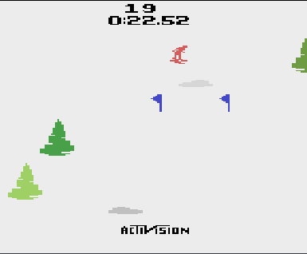
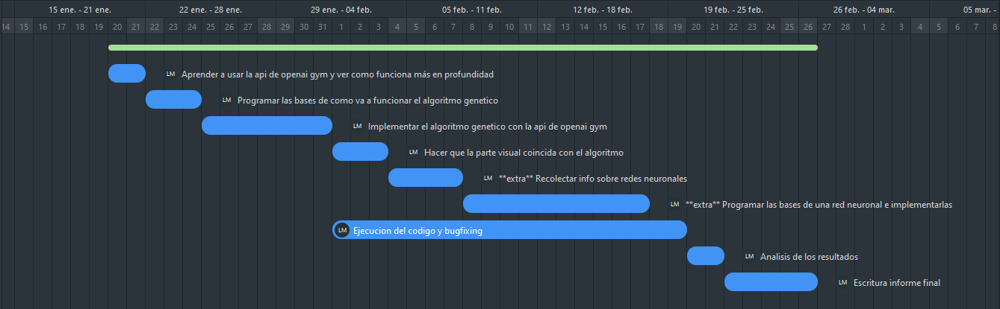

# Algoritmo Genetico que aprende a jugar un videojuego

## Codigo Proyecto: GASKI

### Lucas Moyano

## Descripcion

La idea es programar un algoritmo genetico para el juego de atari **Skiings** que logre el mejor puntaje posible

- Objetivos:

	Que cruze todas las banderas, que no se choque contra obstaculos, que intente minimizar la perdida de velocidad

- Alcance:

	Que pueda jugar Skiings aunque cambien los obstaculos de posicion

- Limitaciones:

	El tiempo de ejecucion, podria tardarse mucho en llegar al mejor tiempo o a un tiempo bueno ya que al principio todo es random.
	No sabemos cual es el mejor tiempo para completar el nivel.
	
- Metricas:
	Banderas cruzadas, obstaculos chocados, el tiempo final.
	Podriamos compararlo con un algoritmo de redes neuronales.
	
Para lograr esto la idea es ejecutar el juego y que de manera random 10 players en contemporaneo vayan yendo a la derecha,a la izquierda o no haga nada hasta llegar al final. Mientras el juego se está ejecutando se creará un arraylist de python para cada player que guardará la acción que se ha realizado (0 si no se hace nada, 1 si se va a la derecha, 2 si se va a la izquierda) en la posicion que representa el segundo en que se hizo (Por ejemplo si se fue a la izquierda cuando el timer dice 0:40:34 se va a guardar en la posicion [403] un 2, descartamos el ultimo numero porque tanta precision no nos sirve). 
Despues de esto vamos a aplicar el algoritmo genetico que según la funcion de fitness va a elegir pares de miembros de la poblacion y los va a reproducir uniendo una parte de uno y la otra parte del otro, el punto de union elegido de manera random.
La función fitness va a ser las unidades por segundo recorridas por el player a la cual se le va a restar algunos segundo por las banderas no cruzadas.
Además vamos a implementar elitismo y guardar los 2 primeros individuos como estan y pasarselos a la proxima generacion, para no perder buenas soluciones.

## Justificacion
Como es un juego en tiempo real el entorno va cambiando cada segundo, haciendo que se haga dificil programarlo de manera tradicional, de esta forma podemos llegar a un algoritmo que llegue al mejor tiempo aunque cambiemos la posicion de los obstaculos (Osea el environment). El algoritmo genetico quizas no sea el más eficiente pero dandole el tiempo necesario da muy buenos resultados.

## Listado de actividades a realizar
1. Aprender a usar la api de openai gym y ver como funciona más en profundidad [2 dias]
2. Programar las bases de como va a funcionar el algoritmo genetico [3 dias]
3. Implementar el algoritmo genetico con la api de openai gym [7 dias]
4. Hacer que la parte visual coincida con el algoritmo [3 dias]
5. **extra** Recolectar info sobre redes neuronales [4 dias]
6. **extra** Programar las bases de una red neuronal e implementarlas [10 dias]
7. Ejecucion del codigo y bugfixing [2 dias]
8. Analisis de los resultados [2 dias]
9. Escritura informe final [5 dias]

## Cronograma estimado de actividades

## Bibliografia
[AIMA 3rd edition](https://zoo.cs.yale.edu/classes/cs470/materials/aima2010.pdf)