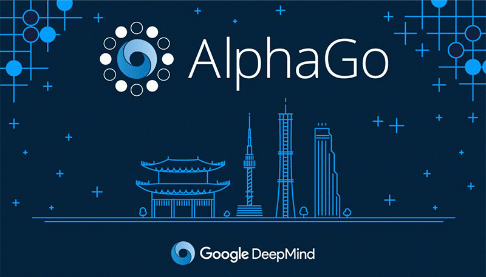

# Trabajo practico Nº 1
#### Lucas Moyano

## Buscar dos ejemplos de aplicaciones de inteligencia artificial.

*Primer ejemplo:*

**google Deep Mind**, el ejemplo más popular de lo que se pudo lograr con Deep Mind es **AlphaGo**, AlphaGo es una inteligencia artificial creado a travez de los algoritmos de aprendizaje de Deep Mind que sabe jugar a GO un juego chino bastante anciano. Lo impresionante de AlphaGo fue que ganó contra el mejor jugador de GO en una partida de años atras, esto no es un concepto nuevo ya que ya ha pasado con jugadores de Ajedrez en donde ahora las computadoras ya juegan a otro nivel que los pro, pero lo impresionante de esto es que **AlphaGo en vez de usar fuerza bruta para calcular todos los posibles movimientos que se pueden hacer, usó reinforcement learning y neural networks para poder llegar a ganar contra el gran maestro de Go.**

**El juego Go es importante en la inteligencia artificial porque a diferencia del ajedrez el numero de movimientos posibles es como el numero de atomos en el universo osea que es imposible calcularlas todas.** Mientras el Ajedrez es un juego de logica el Go es más un juego de intuición. AlphaGo es entrenado usando pixels como input, al principio es entrenado mostrandole miles de partidas de amateurs y pros para que pueda copiarlos pero el objetivo seria que sea mejor entonces lo que hacen es hacer jugar AlphaGo contra si mismo creando cada vez una version que no comete los mismos errores que hizo la version anterior.

Lo bueno de esto es que Deep Mind no nos sirve solo para poder jugar Go, sino que como usa algoritmos generales en teoria podria aplicarse a todo lo que queramos, de hecho **el objetivo de Deep Mind es resolver la inteligencia**. Esto significa entender completamente como crear una inteligencia como la humana.

Esto podria tener muchas aplicaciones en variados campos. En una de las cosas que tambien se está probando es en videojuegos empezando con los más antiguos como Space Invaders hasta juegos más complicados como DOOM.

*Segundo ejemplo:*

**Google experiment Thing Translator**, esta aplicacion te permite tomar foto de algo y podes escuchar como se dice en otro idioma. Nos puede servir por ejemplo si estamos en otro pais en un restaurante y queremos ordenar algo pero no sabemos como pronunciarlo o decirlo.

Esto es posible mediante 2 API de google que son Cloud Vision y Translate. Basicamente, tomas una foto, se manda a la API Cloud Vision que te da varios nombres de lo que ve y un porcentaje de confianza de que sea eso lo que está en la foto, toma el que tiene mayor porcentaje y lo envia al API Translate y listo ya tenemos toda la info que necesitamos. 

Obviamente esto no es perfecto pueden ocurrir varios errores por ejemplo confundir una pelota de golf por un huevo, o sino que la traduccion sea incorrecta porque se traduce fuera de contexto por ejemplo confundir planta por planta industrial en otro idioma. Con esto notamos que todavia estamos trabajando con una inteligencia artificial no tan avanzada porque una supuesta inteligencia artificial tiene que saber distinguir a travez del contexto como lo hacemos los humanos.

## ¿Que se entiende por inteligencia artificial?

Inteligencia artificial se la llama a cuando una maquina hecha por un humano **hace una tarea que normalmente la puede hacer solo un humano gracias a nuestra inteligencia natural**.

Muchas veces las personas cuando se refieren a Inteligencia Artificial se refieren solo a un componente de IA, como el **Machine Learning**. Machine learning es el uso y desarollo de sistemas de computadoras que son capaces de aprender y adaptarse sin seguir instrucciones explicitas, usando algoritmos y modelos estadisticos para analizar y dibujar inferencias desde los patrones en los datos.
Pero la inteligencia artificial no es solo machine learning sino que necesita un fundamento de hardware y software especializado para escribir y entrenar algoritmos de machine learning.

**La inteligencia artificial se puede dividir en 4 categorias basadas en el tipo y complejidad de la tarea que un sistema puede realizar**:
- **Reactive Machines**: (Maquinas reactivas) son capaces de percibir y reaccionar al mundo a su frente mientras realiza tareas limitadas;
- **Limited Memory**: (Memoria limitada) son capaces de guardar datos del pasado y predicciones para hacer predicciones de lo que va a venir;
- **Theory of mind**: (Teoria de la mente) son capaces de tomar decisiones basados en sus percepciones de como los otros se sienten y tomar decisiones;
- **Self-Awareness**: (Consciente de si mismo) son capaces de operar con una consciencia a nivel humano y pueden entender su propria existencia.

Hasta el dia de hoy no hemos llegado al nivel de Theory of mind o de Self-Awareness.

## ¿Que se entiende por inteligencia?

La inteligencia puede ser definida en varias maneras: la capacidad de abstraccion, logica, entendimiento, consciencia de si mismo, aprendimiento, conocimiento emocional, razón, planificacion, creatividad, pensamiento critico y resolucion de problemas.

Más generalmente, puede ser describida como **la abilidad de percibir o inferir información, y mantenerla como conocimiento para aplicarla a conductas adptativas dentro de un ambiente o contexto.**

## ¿Que se entiende por artificial?

Artificial se entiende **a todo aquello creado por un humano que no se encuentra en ese estado en la naturaleza**

### Fuentes

[8 Crazy A.I. Websites You Probably Didn't Know Existed!](https://www.youtube.com/watch?v=SPsuVmCiwVQ)

[What is Artificial Intelligence Exactly?](https://www.youtube.com/watch?v=kWmX3pd1f10)

[What is artificial intelligence (AI)?](https://www.techtarget.com/searchenterpriseai/definition/AI-Artificial-Intelligence)

[Introduction to AI](https://builtin.com/artificial-intelligence)

[Wikipedia intellingence](https://en.wikipedia.org/wiki/Intelligence)

[A.I. Experiments: Thing Translator](https://www.youtube.com/watch?v=bH5sU7ew5V4&feature=emb_imp_woyt)

[Google's Deep Mind Explained! - Self Learning A.I.](https://www.youtube.com/watch?v=TnUYcTuZJpM)