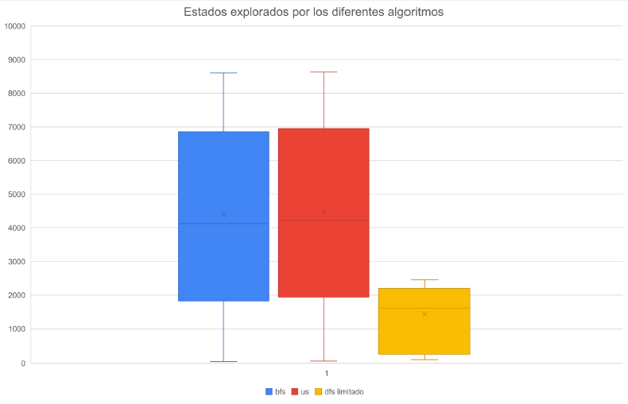
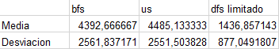

# TP3
## Lucas moyano

B) 

nota: en dfs limitado se excluyen los resultado en donde no llega a la solucion por eso los estados explorados son menores

C) El algoritmo más adecuado para resolver este problema es el bfs ya que su media es más baja y llega siempre al resultado. Esto se debe a que bfs es optimal cuando todas las paths tienen el mismo costo, que es el caso de este problema
