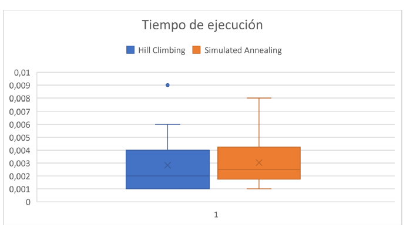
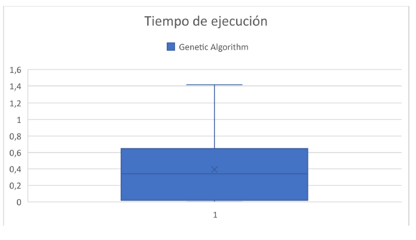
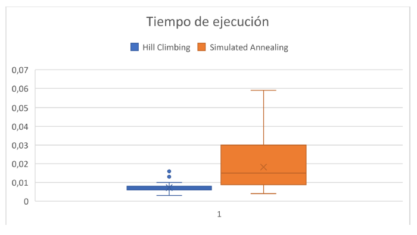
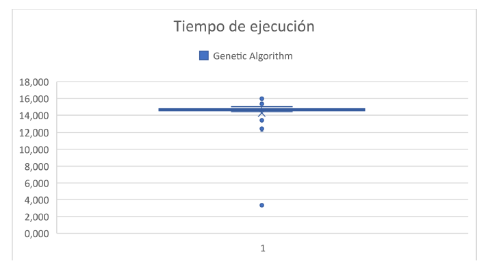
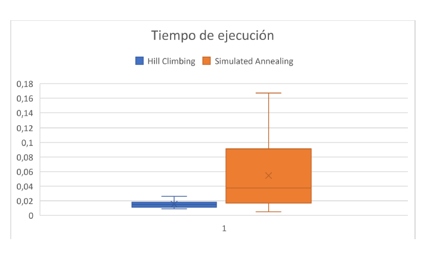
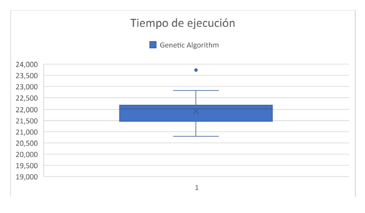
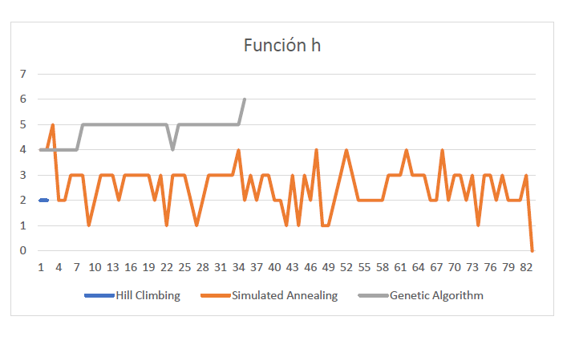

# TP 5 informe
### Lucas Moyano

- A)
### 4 reinas

### 8 reinas

### 10 reinas

- B)

- C)

Según las estadisticas que he obtenido el algoritmo más indicado para solucionar el problema de las n-reinas es el de simulated annealing ya que a parte de ser muy rapido no recorre tantos estados como el genetic algorithm y es optimo, no como el hill climbing