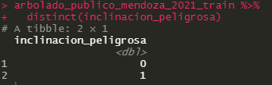
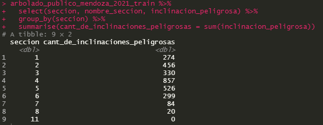
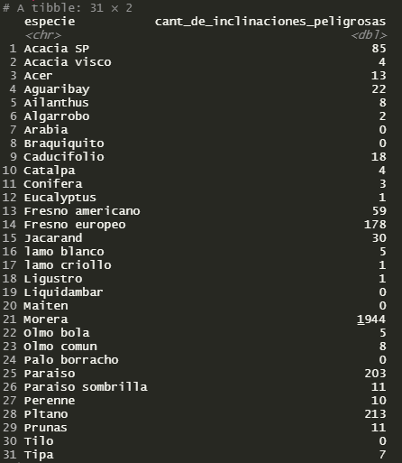

# TP7
### Lucas Moyano

a) Es una distribución binomial

b) Si, mientras más inclinaciones peligrosas tienen más peligrosa es una seccion, aquí una tabla:

c) En realidad no se puede considerar si una especie es más peligrosa porque podria simplemente haber más arboles de esa especie, pero graficamente podemos verlo como:

