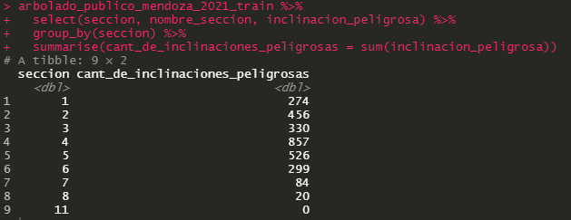

# TP7
### Lucas Moyano
## A
a) Es una distribución binomial

b) Si, mientras más inclinaciones peligrosas tienen más peligrosa es una seccion, aquí una tabla:

c) En realidad no se puede considerar si una especie es más peligrosa porque podria simplemente haber más arboles de esa especie, pero graficamente podemos verlo como:

## B
### Histograma de frecuencia para la variable circ_tronco_cm

### Histograma de frecuencia para la variable circ_tronco_cm sin inclinacion peligrosa

### Histograma de frecuencia para la variable circ_tronco_cm con inclinacion peligrosa

## C
Los criterios de corte para decidir si circ_tronco_cm_cat es bajo, medio, alto, muy alto son:

- si circ_tronco_cm < 100 entonces circ_tronco_cm_cat = bajo
- si circ_tronco_cm >= 100 y circ_tronco_cm < 200 entonces circ_tronco_cm_cat = medio
- si circ_tronco_cm >= 200 y circ_tronco_cm < 300 entonces circ_tronco_cm_cat = alto
- si circ_tronco_cm >= 300 y circ_tronco_cm < 500 entonces circ_tronco_cm_cat = muy alto